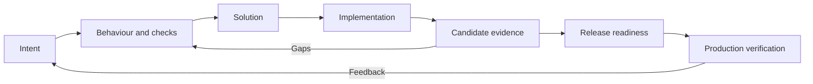

# Engineering workflow: from intent to verified production

Use this workflow with the [engineering profile](engineering-template.mara.md).
It describes how to use the vocabulary and checks for one bounded change. Work
in small increments, plan verification before implementation, and revisit earlier
knowledge when implementation or production reveals a gap. Each checkpoint applies
to the selected change; the whole product's documentation need not be complete.

The examples below describe a fictional record-export feature. They illustrate
relationships and do not declare requirements or evidence for Mara itself.

## 1. Establish intent

Write a `goal` explaining the desired outcome and how its achievement will be
recognized. Identify an `actor` when a participant distinction affects behaviour.
Add `scenario` items for the concrete flows in this change, including relevant
failure outcomes. Keep explanations alongside their owning items.

Example: an operator needs to share authorized records with another system.
`SCN-EXPORT contributes_to GOAL-SHARE` and `SCN-EXPORT involves ACT-OPERATOR`.
The scenario describes selecting records, requesting an export, and receiving a
usable file, including what happens when access is denied.

**Checkpoint:** the intended beneficiary, outcome and scope are understood. Open
questions remain visible in drafts; delivery tasks belong in the issue tracker.

## 2. Specify behaviour and plan its checks

Extract independently verifiable `requirement` items from the scenarios and
relevant constraints. Classify them using the profile's fields, connect their
origin, and state observable acceptance criteria. Separate obligations that can
be implemented or verified independently.

Plan how each obligation will be checked. Create a `verification` when the
repeatable method needs its own identity; record its setup, action and expected
result in the body. It `verifies` a requirement or design, or `validates` a goal
or scenario. Ordinary automated checks can instead connect directly from code
using `checks` once that code exists.

Example: `REQ-EXPORT-SCOPE derives_from SCN-EXPORT` requires the exported records
to respect the operator's access. `VER-EXPORT-SCOPE verifies REQ-EXPORT-SCOPE`
defines a test using records with different access permissions. A separate
demonstration validates that the recipient can use the resulting file.

**Checkpoint:** agree the relevant records and mark them `accepted` when their
content and required links are ready. Run project validation and assess intent
and verification coverage. Acceptance establishes the agreed obligation and its
check definition; execution results are collected later.

## 3. Define the solution and address relevant risks

Add `design` items for durable interfaces, data formats, architectural boundaries
or deployment contracts needed to implement the change. Connect them with
`satisfies`, and use `refines` when decomposing an existing design. Record a
`decision` for a consequential choice among alternatives and connect it with
`justifies`. Routine code organization can remain in code.

Identify material `risk` items and affected knowledge. Describe actual mitigation
measures or the decision to tolerate exposure. For deployment, define relevant
configuration, dependencies, data migration and recovery behaviour where the
change requires them; these can live in a design with `kind: deployment`.

Example: a format design satisfies the export-format requirement. An access
control design mitigates the risk of disclosing unauthorized records.

**Checkpoint:** implementers can build and check the selected change without
inventing missing behaviour. Resolve questions that would materially change its
acceptance, compatibility or data safety before relying on the answer in code.

## 4. Implement and connect the real code

Build the implementation and its checks. Link code with `implements` to the
requirement, design or verification method it implements. Use `checks` for a
direct code-to-requirement/design test association. Introduce an `artifact` only
when a concrete output needs independent identity, and connect it with `realizes`.

Keep affected knowledge current as implementation reveals details. Use the
realization check for the selected requirements and designs, alongside the
verification-definition check. A source association establishes a connection;
the next checkpoint establishes what happened when the checks ran.

**Checkpoint:** the primary workflow operates end to end with the real components
needed for this change. Identify remaining mocks or substitutes explicitly and
do not use them as proof of the production workflow.

## 5. Verify and validate a specific candidate

Build an identifiable candidate and run the required checks against it. Verify
the obligations and validate the intended user outcome. Choose the relevant test
levels and other methods from the actual acceptance criteria.

For results that need durable traceability, record `evidence` linked through
`evidences` to the performed verification. Supply `result`, `captured_at` and the
actual tested `subject_revision` or immutable build identity. Put environment,
configuration, inputs, observed outcome and relevant limitations in the body or
referenced report; use `reported_at` for an external report. Routine run logs can
remain in CI.

Example: evidence for `VER-EXPORT-SCOPE` records the candidate's exact identity,
the access configuration used, the observed exported records and the result.
`HEAD` would not preserve that tested identity.

**Checkpoint:** results from the required checks support the candidate's stated
acceptance criteria.
Investigate relevant failures and inconclusive or conflicting results; the
existence of another passing record does not settle them. Record exclusions and
their rationale. A changed candidate requires reassessing which evidence applies.

Assess the selected verifications with the profile's
[execution check](engineering-template.mara.md#selected-scope-assessments), supplying
the candidate's concrete `subject_revision` parameter. Inspect the evidence and
reports alongside the matrix: a matching passing record alone does not resolve
conflicting results or establish that the tested environment suits production.

## 6. Establish readiness to deploy

Review the selected scope against its accepted criteria and candidate evidence.
Confirm that the candidate selected for deployment is the build assessed, and that relevant
deployment prerequisites and recovery instructions are usable. Review open risks
and resolve release blockers or record an explicit, justified treatment.

The deployment or release process records the readiness decision, responsibility, candidate
identity and rollout evidence. Keep durable operating contracts in Mara documents
and operational task/run records in the delivery systems. A release does not
require a new Mara flavour or a new knowledge status.

**Checkpoint:** the candidate is ready to deploy under the project's release
criteria. Production success still needs evidence from the intended environment.

## 7. Deploy and verify production behaviour

Deploy through the project's normal process and identify what was actually
deployed. Perform the planned production checks against that artifact and its
configuration. Verify the relevant user scenario and operational observations;
record the environment and deployment/run references with the evidence.

Example: a planned demonstration confirms that an authorized operator
can export the intended records and the recipient can use the file. Its evidence
identifies the deployed candidate and production environment; staging evidence
alone does not establish this outcome.

If the agreed production checks fail, follow the project's recovery process and
record the actual outcome. Feed discovered gaps back into requirements, designs,
checks or risk treatment. Preserve useful prior evidence rather than rewriting
its result to describe a later run.

**Completion:** the intended implementation is deployed, the required production
checks meet their stated acceptance criteria, relevant risks have an explicit
treatment, and affected durable knowledge is current. Further production feedback
starts the next bounded change.

## What Mara establishes

Project validation checks authored knowledge against the schema and enabled
policies. Matrices assess the explicitly selected relationships and conditions.
Their results help locate gaps, but do not execute tests, deploy software, verify
report authenticity, choose the project's release criteria or declare production
readiness. Review the evidence for those conclusions. The item status remains a
statement about the knowledge record throughout this workflow.
